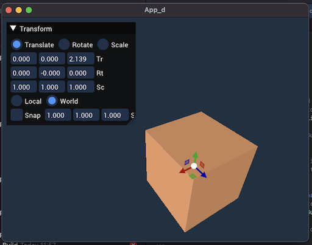
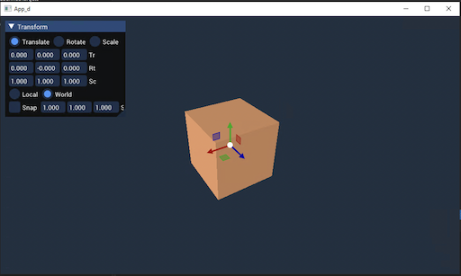
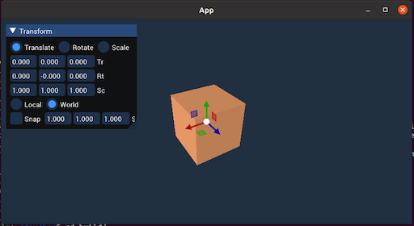
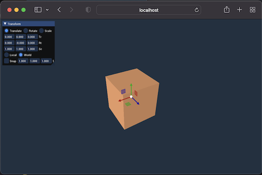

# BAM! framework 

Linux [](https://cedricguillemet.visualstudio.com/Bam/_build/latest?definitionId=4&branchName=main)
Emscripten [](https://cedricguillemet.visualstudio.com/Bam/_build/latest?definitionId=4&branchName=main)

MacOS [](https://cedricguillemet.visualstudio.com/Bam/_build/latest?definitionId=4&branchName=main)
Windows [](https://cedricguillemet.visualstudio.com/Bam/_build/latest?definitionId=4&branchName=main)


A template/framework for experiments using bgfx/dear imgui/imguizmo.
Fork this repo, clone it and start hacking.
Build for Win32/Linux/MacOS and Web with 1 repo, 1 codebase.
Goal is to clone, write the first line of code and build for your platform within 5 Min.






I encourage you to add any 'must have' sub-repo and extend the sample app accordingly.
(As long as it's not Boost.)

## Build

Binary output directory is `bin/`

### Clone repo
```
git clone https://github.com/CedricGuillemet/bam.git --recurse-submodules
```

### Windows
```
mkdir build
cd build
cmake .. -G "Visual Studio 16 2019" -A x64
```
And open .sln with Visual Studio

### Mac
```
mkdir build
cd build
cmake .. -G Xcode
```

And open project with Xcode

### Linux
```
mkdir build
cd build
cmake .. -G Ninja
ninja
```

### Web

Clone and activate emsdk https://github.com/emscripten-core/emsdk
Install your favorite build tool supported by cmake (ninja, make, ...)
```
mkdir build
cd build
emcmake cmake .. -G Ninja -DCMAKE_BUILD_TYPE=Release
ninja
```
#### Test web

In `bin` folder:

```
python3 -m http.server
```
